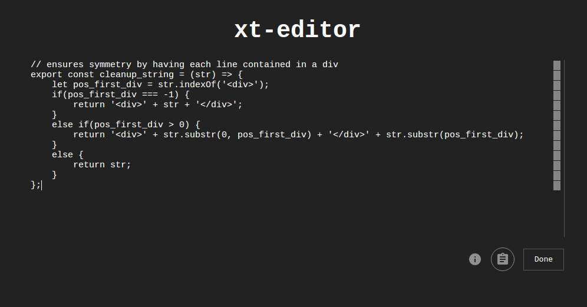

# xt-editor
Text editor/notepad for quick notes. Drag and drop lines/paragraphs for easier editing.



## Build
```
$ yarn
$ npm start
```

## Known Bugs
* Cannot handle lines of width more than width of container element.
* Intermittent issues with creating paragraphs.
* Copied text retains formatting.
